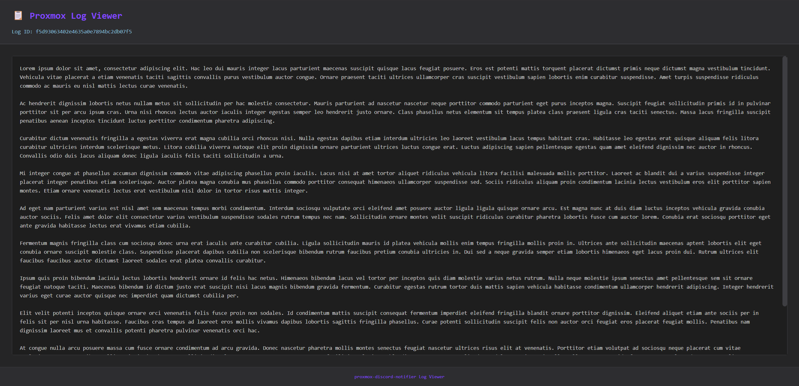

# proxmox-discord-notifier

Reliable Proxmox Backup and VM Log Notifications in Discord



[](LICENSE)

## Overview

Discord enforces a 2000‑character limit per message, which can truncate lengthy Proxmox backup logs or VM events and obscure critical details. **proxmox-discord-notifier** solves this by:

- Capturing full Proxmox output in raw log files.
- Sending concise Discord notifications with a link to the complete log.

Whether you run nightly backups or ad‑hoc snapshots, **proxmox-discord-notifier** ensures you never miss important context.

## Features

- **Raw Log Storage** — Saves complete Proxmox logs in a configurable directory.
- **Discord Embeds** — Sends rich notifications with title, severity, custom description, and log link.
- **Optional User Mentions** — Include a Discord user ID to automatically @mention a specific user in the alert.
- **Configurable Retention** — Auto-cleanup of old logs after _N_ days (default: 30 days; set to 0 to keep forever).
- **Dark-Mode Log Viewer** — Built-in HTML log viewer with dark theme for browsers.
- **Health Endpoint** — `/health` probe for orchestrator readiness/liveness checks.
- **Security Hardened** — Non-root container, SSRF protection on webhook URLs, path traversal hardening on log IDs, message size limits.
- **Lightweight** — Single Python package on FastAPI; managed with `uv`.
- **Docker‑Ready** — Multi-stage-adjacent Dockerfile with HEALTHCHECK and non-root runtime.
- **Comprehensive Test Suite** — 130+ tests covering config, endpoints, Discord, log cleanup, and schema validation.

## Prerequisites

- Docker _(or Python 3.12+ with `uv`)_

## Quickstart

### Using Docker

```bash
docker run -d \
  --name proxmox-discord-notifier \
  --restart unless-stopped \
  -e TZ=UTC \
  -e DISCORD_WEBHOOK="https://discord.com/api/webhooks/YOUR_ID/YOUR_TOKEN" \
  -e LOG_RETENTION_DAYS=30 \
  -p 6068:6068 \
  -v p2d_logs:/var/logs/p2d \
  ghcr.io/skulldorom/proxmox-discord-notifier:latest
```

Or with Docker Compose:

```yaml
services:
  proxmox-discord-notifier:
    container_name: proxmox-discord-notifier
    image: ghcr.io/skulldorom/proxmox-discord-notifier:latest
    restart: unless-stopped
    volumes:
      - p2d_logs:/var/logs/p2d
    environment:
      - TZ=UTC
      - DISCORD_WEBHOOK=https://discord.com/api/webhooks/YOUR_ID/YOUR_TOKEN
      - LOG_RETENTION_DAYS=30
    ports:
      - "6068:6068"

volumes:
  p2d_logs:
    name: p2d_logs
```

```bash
docker compose up -d
```

### Verify

| Check | What |
|-------|------|
| Interactive API docs | [http://<YOUR_HOST>:6068/docs](http://<YOUR_HOST>:6068/docs) |
| Health probe | `curl http://<YOUR_HOST>:6068/health` → `{"status":"ok"}` |

The Docker image includes a `HEALTHCHECK` that pings `/health` every 30 seconds — orchestrators like Docker Swarm, Nomad, or k8s can use this for readiness probes.

## Proxmox Integration

Point your Proxmox cluster at the `/notify` endpoint so every alert is mirrored to Discord and archived.

### Configuration

The Discord webhook URL can be configured in two ways:

1. **Environment Variable** (Recommended): Set `DISCORD_WEBHOOK` in your Docker/environment
2. **Request Payload**: Include `discord_webhook` in each request (overrides environment variable)

#### Custom Base URL (Behind Proxy)

If your service is behind a reverse proxy or accessed via a custom domain, set the `BASE_URL` environment variable to ensure log URLs are generated correctly:

```bash
# Docker
docker run -d \
  --name proxmox-discord-notifier \
  -e DISCORD_WEBHOOK="https://discord.com/api/webhooks/YOUR_ID/YOUR_TOKEN" \
  -e BASE_URL="https://your-domain.com" \
  -p 6068:6068 \
  ghcr.io/skulldorom/proxmox-discord-notifier:latest
```

```yaml
# docker-compose
environment:
  - DISCORD_WEBHOOK=https://discord.com/api/webhooks/YOUR_ID/YOUR_TOKEN
  - BASE_URL=https://your-domain.com
```

Without `BASE_URL`, log URLs are generated from the incoming request, which may not work correctly behind a proxy.

#### Log Retention

By default, logs are kept for 30 days and then automatically deleted. Configure with `LOG_RETENTION_DAYS`:

- **Default**: `30` (keeps logs for 30 days)
- **Never delete**: Set to `0` to keep logs forever
- **Custom duration**: Set to any positive number of days

```bash
# Keep logs for 7 days
docker run -d \
  --name proxmox-discord-notifier \
  -e DISCORD_WEBHOOK="https://discord.com/api/webhooks/YOUR_ID/YOUR_TOKEN" \
  -e LOG_RETENTION_DAYS=7 \
  -p 6068:6068 \
  ghcr.io/skulldorom/proxmox-discord-notifier:latest
```

The cleanup task runs automatically every 24 hours starting when the application launches.

### Setup with Environment Variable

If you set the `DISCORD_WEBHOOK` environment variable, you can omit it from the request body:

| UI Field          | Value / Example                                                                                                                                                                      |
| ----------------- | ------------------------------------------------------------------------------------------------------------------------------------------------------------------------------------ |
| **Endpoint Name** | `proxmox-discord-notifier`                                                                                                                                                           |
| **Method**        | `POST`                                                                                                                                                                               |
| **URL**           | `http://<API_SERVER_IP>:6068/api/notify`                                                                                                                                             |
| **Headers**       | `Content-Type: application/json`                                                                                                                                                     |
| **Body**          | <pre lang=json>{<br/> "title" : "{{ title }}",<br/> "message": "{{ escape message }}",<br/> "severity": "{{ severity }}",<br/> "mention_user_id":"{{ secrets.user_id }}"<br/>}</pre> |
| **Secrets**       | `user_id` → your Discord user ID (optional)                                                                                                                                          |
| **Enable**        | ✓                                                                                                                                                                                    |

### Setup with Request Payload

If you prefer to include the webhook in each request or need per-request webhooks:

| UI Field          | Value / Example                                                                                                                                                                                                                                                                       |
| ----------------- | ------------------------------------------------------------------------------------------------------------------------------------------------------------------------------------------------------------------------------------------------------------------------------------- |
| **Endpoint Name** | `proxmox-discord-notifier`                                                                                                                                                                                                                                                            |
| **Method**        | `POST`                                                                                                                                                                                                                                                                                |
| **URL**           | `http://<API_SERVER_IP>:6068/api/notify`                                                                                                                                                                                                                                              |
| **Headers**       | `Content-Type: application/json`                                                                                                                                                                                                                                                      |
| **Body**          | <pre lang=json>{<br/> "discord_webhook": "https://discord.com/api/webhooks/{{ secrets.id }}/{{ secrets.token }}",<br/> "title" : "{{ title }}",<br/> "message": "{{ escape message }}",<br/> "severity": "{{ severity }}",<br/> "mention_user_id":"{{ secrets.user_id }}"<br/>}</pre> |
| **Secrets**       | `id` → your Discord webhook **ID**<br>`token` → your Discord webhook **token** <br>`user_id` → your Discord user ID (optional)                                                                                                                                                        |
| **Enable**        | ✓                                                                                                                                                                                                                                                                                     |

> **Note**: If both environment variable and request payload contain a webhook URL, the request payload takes precedence.

### Custom Embed Description

You can include a `discord_description` field (max 4096 characters) in the request body to add custom text to the Discord embed — useful for including truncated summaries or contextual notes alongside the full log link.

```json
{
  "title": "Backup Failed",
  "message": "...full 50KB Proxmox output...",
  "severity": "error",
  "discord_description": "VM 104 — nightly backup to NFS share timed out after 30 minutes"
}
```

## Development

### Setup

```bash
# Clone and install with uv
git clone https://github.com/Skulldorom/proxmox-discord-notifier.git
cd proxmox-discord-notifier
uv sync
```

### Run Locally

```bash
uv run proxmox-discord-notifier serve --host 127.0.0.1 --port 6068
```

Set `DISCORD_WEBHOOK` in your environment or create a `.vscode/launch.json` with an `envFile` for local development.

### Run Tests

```bash
uv run pytest -v
```

The test suite covers:
- **Config** — settings validation, webhook URL SSRF protection, base URL quoting
- **Endpoints** — notify flow, health check, log retrieval, error cases
- **Discord** — payload building, webhook delivery
- **Log Cleanup** — retention policies, edge cases
- **Schema** — validation, field limits, error messages

### Lint

```bash
uv run ruff check .
```

## Credits

This project is maintained by [Skulldorom](https://github.com/Skulldorom). While this implementation represents a fresh approach to Proxmox-to-Discord notifications, it may build upon concepts and ideas from earlier community projects in the Proxmox ecosystem.

## License

Released under the [MIT License](LICENSE).

Copyright (c) 2025 Jordan Shaw
